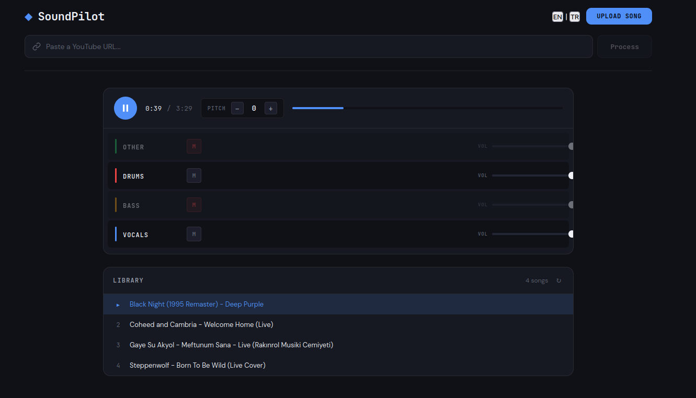

# SoundPilot



Paste a YouTube link or upload an audio file — SoundPilot separates vocals, drums, bass, and other instruments into individual tracks. Mix them with real-time pitch shifting, mute, and volume controls.

Built with Demucs (Meta AI), FastAPI, SvelteKit, and Tone.js.

## Features

- YouTube URL or file upload
- AI stem separation (vocals, drums, bass, other)
- Real-time multitrack mixer
- Per-track mute and volume
- Global pitch shifting
- Song library with auto-save

## Run with Docker

```bash
git clone https://github.com/OktayBalaban/SoundPilot.git
cd SoundPilot
docker compose up --build
```

Open `http://localhost:3000`.

NVIDIA GPU is optional — speeds up Demucs significantly but not required.